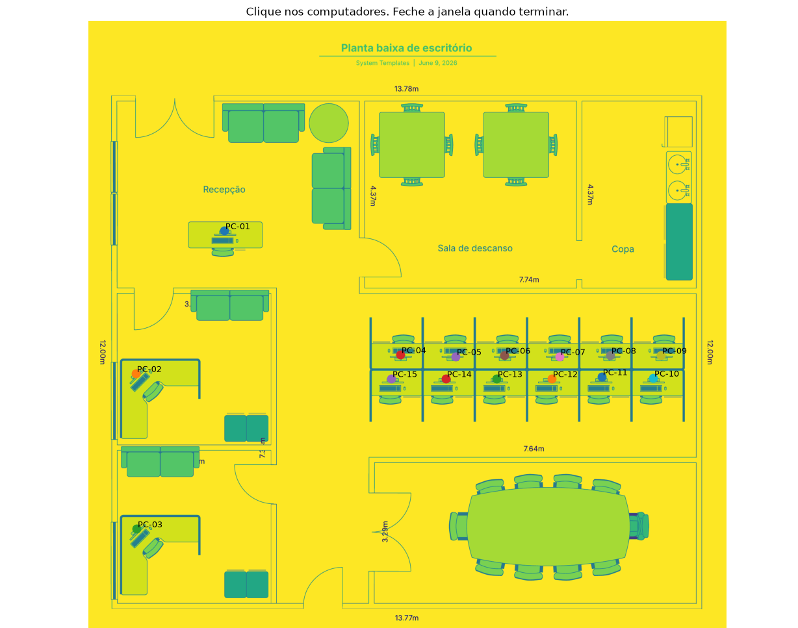
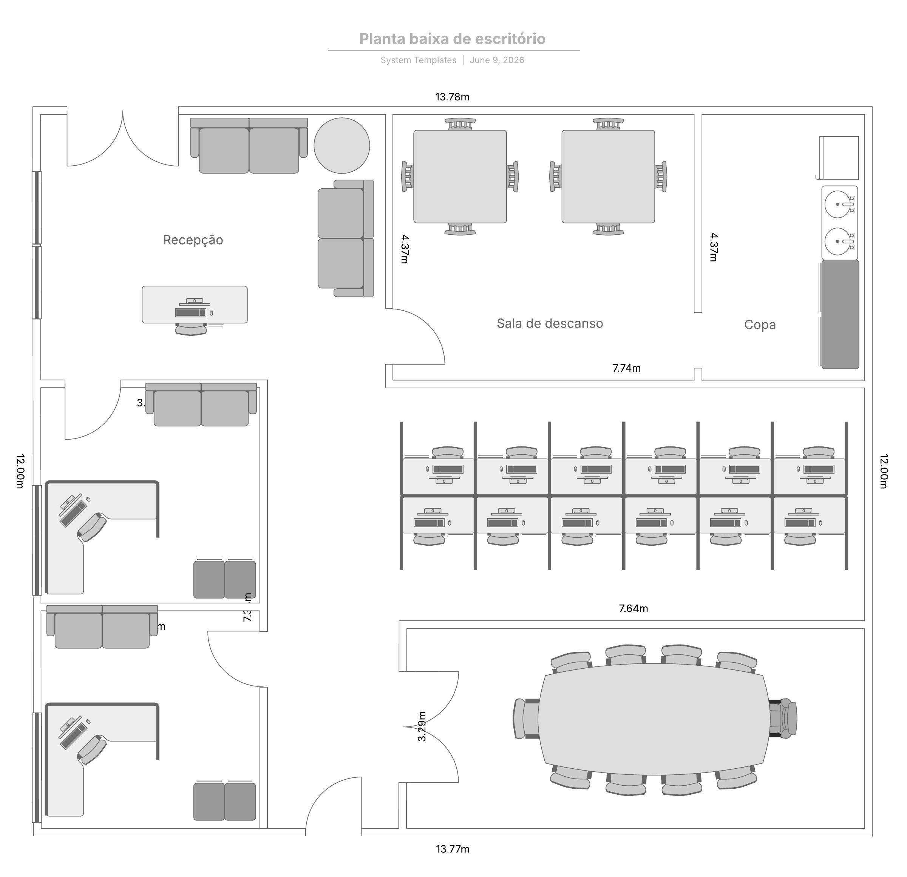

# 🖥️ Inventário de Computadores com Planta Interativa

Sistema desenvolvido em **Python + Streamlit + Plotly** para gerenciamento visual de computadores através de uma **planta baixa interativa**.

O projeto permite localizar equipamentos diretamente na planta do escritório, consultar informações, editar dados, cadastrar novas máquinas, exportar relatórios e acompanhar o inventário de forma simples e intuitiva.

---

# ✨ Demonstração

> https://inventario-computadores-planta.streamlit.app/

---

# 📷 Preview do Sistema

O sistema utiliza uma planta baixa do escritório onde **cada computador foi geolocalizado manualmente através de coordenadas (X, Y)**. Dessa forma, cada equipamento é representado por um ponto interativo exatamente na sua posição física, permitindo localizar rapidamente qualquer máquina no ambiente.

<p align="center">
  
</p>

---

### 🗺️ Geolocalização dos computadores

Cada computador foi posicionado na planta utilizando coordenadas cartesianas (X, Y), criando um mapa interativo do ambiente.

Esse processo envolveu:

- 📍 Geolocalização manual de todos os computadores na planta;
- 🎯 Associação das coordenadas de cada equipamento ao inventário;
- 🖱️ Seleção direta do computador clicando sobre sua posição física;
- 🎨 Identificação visual por cores conforme o status da máquina;
- 🔄 Sincronização entre o mapa e os detalhes exibidos na lateral do sistema.

Essa abordagem torna a localização dos equipamentos muito mais rápida do que consultar apenas uma lista tradicional de inventário.

---

### 🏢 Planta utilizada

<p align="center">
  
</p>

---

# 🚀 Funcionalidades

## 🗺️ Planta interativa

* Visualização dos computadores sobre a planta baixa.
* Cada computador é representado por um ponto colorido.
* Destaque visual para o computador selecionado.

---

## 🖱️ Seleção de computadores

O sistema permite selecionar uma máquina de duas formas:

* clicando diretamente sobre a planta;
* selecionando pela lista lateral.

Ao selecionar um computador, os detalhes são atualizados automaticamente.

---

## 📋 Informações do equipamento

Cada computador possui informações como:

* Nome
* Status
* Sala
* Usuário
* Patrimônio
* Endereço IP
* Sistema Operacional
* Memória RAM
* Processador
* Observações

---

## 🎨 Status por cores

| Status        | Cor      |
| ------------- | -------- |
| 🟢 Ativo      | Verde    |
| 🔴 Desligado  | Vermelho |
| 🟠 Manutenção | Laranja  |
| 🔵 Reserva    | Azul     |

---

## 🔎 Busca inteligente

Pesquisa por:

* Nome do computador
* Usuário
* Patrimônio
* Endereço IP

---

## 🎯 Filtro por status

Permite visualizar apenas:

* Ativos
* Desligados
* Manutenção
* Reserva

---

## ⚠️ Alertas inteligentes

O sistema identifica automaticamente computadores que possuem:

* máquina em manutenção;
* computador desligado;
* usuário não informado;
* pouca memória RAM;
* sistema operacional antigo;
* observações críticas.

---

## ✏️ Edição de computadores

Permite editar:

* nome;
* sala;
* usuário;
* patrimônio;
* IP;
* sistema operacional;
* RAM;
* processador;
* observações;
* coordenadas da planta;
* status.

As alterações são gravadas diretamente no arquivo CSV.

---

## ➕ Cadastro de novos computadores

É possível adicionar novos equipamentos informando:

* identificação;
* localização;
* usuário;
* patrimônio;
* IP;
* status;
* coordenadas X e Y na planta.

---

## 📦 Importação em massa

Importação de computadores através de arquivo CSV.

Ideal para inventários grandes.

---

## 💾 Backup automático

Antes de qualquer alteração o sistema cria automaticamente uma cópia de segurança do inventário.

---

## 📝 Histórico de movimentações

Sempre que um computador muda de:

* sala;
* usuário;
* posição na planta;

o sistema registra a alteração em:

```
data/movimentacoes.csv
```

---

## 📤 Exportação

O inventário pode ser exportado em:

* CSV
* Excel
* PDF
* JPG da planta

---

# 🛠️ Tecnologias utilizadas

* Python 3
* Streamlit
* Plotly
* Pandas
* Pillow
* OpenPyXL
* ReportLab

---

# 📂 Estrutura do projeto

```text
inventario-computadores-planta/
│
├── app.py
├── requirements.txt
│
├── assets/
│   ├── planta.png
│   └── planta_base.jpg
│
├── data/
│   ├── computadores.csv
│   └── movimentacoes.csv
│
└── src/
    ├── mapa.py
    ├── preparar_planta.py
    └── capturar_coordenadas.py
```

---

# ⚙️ Instalação

Clone o projeto:

```bash
git clone https://github.com/IsaMoraess/inventario-computadores-planta.git
```

Entre na pasta:

```bash
cd inventario-computadores-planta
```

Crie um ambiente virtual:

```bash
python -m venv .venv
```

Ative:

### Linux

```bash
source .venv/bin/activate
```

### Windows

```bash
.venv\Scripts\activate
```

Instale as dependências:

```bash
pip install -r requirements.txt
```

---

# ▶️ Executando

```bash
streamlit run app.py
```

O sistema ficará disponível em:

```
http://localhost:8501
```

---

# 📌 Possíveis aplicações

* Inventário de computadores
* Controle patrimonial
* Gestão de ativos de TI
* Laboratórios de informática
* Escolas
* Universidades
* Empresas
* Órgãos públicos
* Call Centers
* Data Centers

---

# 🔮 Melhorias futuras

* Integração com banco de dados PostgreSQL
* Login de usuários
* Controle de permissões
* Dashboard gerencial
* Monitoramento em tempo real
* Integração com Active Directory
* Ping automático dos equipamentos
* Inventário automático via rede
* QR Code para patrimônio
* Histórico completo de alterações

---

# 👩‍💻 Desenvolvedora

**Isabelly Moraes**

* Python
* Engenharia de Dados
* Análise de Dados
* Back-end
* Soluções Geoespaciais

https://www.linkedin.com/in/isabellyprogramadora/

---

⭐ Se este projeto foi útil, deixe uma estrela no repositório.
